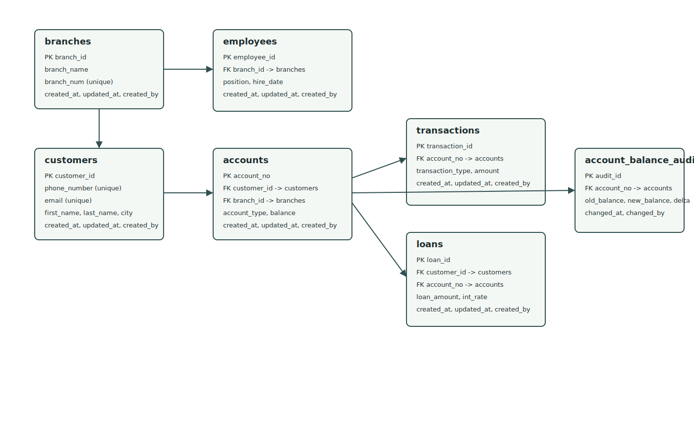

# MetroBank Production SQL Project

Production-ready PostgreSQL banking data model with hardened schema constraints, parent-first migrations, staging-to-production import, role-based access, and trigger-driven balance audit logging.

## Project Structure

- [migrations/01_schema.sql](migrations/01_schema.sql): Parent-first table creation with strict data types and core constraints.
- [migrations/02_constraints.sql](migrations/02_constraints.sql): Indexes, role grants, updated_at triggers, and balance audit trigger.
- [setup.sql](setup.sql): One-command schema setup entrypoint.
- [seed.sql](seed.sql): Staging-to-production CSV load with cleansing and merge logic.
- [scripts/load_staging.sh](scripts/load_staging.sh): Bash automation for setup + seed.
- [data/accounts.csv](data/accounts.csv)
- [data/branches.csv](data/branches.csv)
- [data/customers.csv](data/customers.csv)
- [data/employees.csv](data/employees.csv)
- [data/loans.csv](data/loans.csv)
- [data/transactions.csv](data/transactions.csv)
- [docs/erd.svg](docs/erd.svg): Entity Relationship Diagram.
- [docs/data_dictionary.md](docs/data_dictionary.md): Table and column definitions.
- [scripts/ddl.sql](scripts/ddl.sql): Legacy practice script retained for reference.
- [scripts/dml.sql](scripts/dml.sql): Legacy practice script retained for reference.
- [scripts/dql.sql](scripts/dql.sql): Query scratchpad.

## ERD



## What Was Hardened

- Strict typing and constraints
- Email validation with regex CHECK constraint
- Phone normalization and UK phone format CHECK constraint
- Positive-value checks for balances, transactions, and loan amounts
- Audit metadata on every table: created_at, updated_at, created_by
- Parent-first FK-safe schema design and load order

## Parent-First Migration Logic

Schema and load process follows dependency order:

1. branches
2. customers
3. employees (depends on branches)
4. accounts (depends on branches and customers)
5. transactions (depends on accounts)
6. loans (depends on accounts and customers)

This order prevents FK dependency violations such as SQLSTATE 23503 during batch loads.

## Advanced Import Strategy (Staging to Production)

The load strategy in [seed.sql](seed.sql) is:

1. Create temporary staging tables with all-text columns.
2. Load CSV files into staging with psql \copy.
3. Cleanse and normalize data:
   - Replace missing/invalid emails with generated defaults.
   - Normalize phone numbers to +44 format.
   - Standardize account and transaction type values.
4. Merge into production tables using ON CONFLICT upserts in FK-safe order.
5. Commit atomically in one transaction.

## Security Model

Defined roles:

- app_user: CRUD on tables (no elevated DDL privileges).
- readonly_analyst: SELECT-only access.

Roles and default privileges are configured in [migrations/02_constraints.sql](migrations/02_constraints.sql).

## Performance & Observability

- B-tree indexes added for common access patterns:
  - accounts.customer_id
  - accounts.account_no
  - transactions.account_no
- Trigger-based logging for customer balance changes:
  - Source trigger on accounts.balance updates
  - Sink table: account_balance_audit_log

## Setup and Run

Prerequisites:

- PostgreSQL 13+
- psql client

1. Create the database.

```sql
CREATE DATABASE metrobank;
```

2. Apply schema and hardening.

```bash
psql -d metrobank -f setup.sql
```

3. Load data through staging workflow.

```bash
psql -d metrobank -f seed.sql
```

4. Or run all-in-one loader.

```bash
./scripts/load_staging.sh metrobank
```

## Error Handling Procedure (Batch Insert Failures)

Batch loads are fail-fast and atomic because seed uses:

- psql ON_ERROR_STOP enabled
- Single transaction wrapper (BEGIN/COMMIT)

If a batch fails:

1. Rollback is automatic because the transaction aborts.
2. Review the failing statement and line in psql output.
3. Investigate raw rows in source CSVs under [data/](data/).
4. Re-run only after fixing data or transformation logic.
5. Validate with row counts and spot checks before handing off.

Recommended post-load checks:

```sql
SELECT COUNT(*) FROM customers;
SELECT COUNT(*) FROM accounts;
SELECT COUNT(*) FROM transactions;
SELECT COUNT(*) FROM loans;
SELECT COUNT(*) FROM account_balance_audit_log;
```
